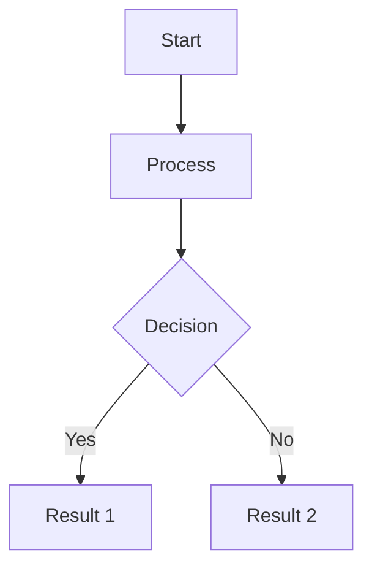
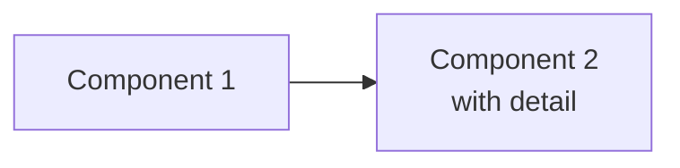

# DigitalDen Post Template

This template captures your writing style, structure, and preferred use of Chirpy features. Use it as a reference when creating new posts.

---

## Front Matter Template

```yaml
---
title: "Post Title — Optional Subtitle"
date: YYYY-MM-DD HH:MM:SS +/-TTTT
categories: [Primary Category, Secondary Category]
tags: [tag1, tag2, tag3, tag4]
mermaid: true                    # Include if using diagrams
math: true                       # Include if using equations
description: "A compelling 1-2 sentence description. This appears in previews, RSS feeds, and under the title. Write it to hook readers and set expectations."
image: 
  path: /assets/img/headers/header-image.webp
  lqip: data:image/webp;base64,YOUR_BASE64_STRING
---
```

### Front Matter Notes

**Title conventions:**
- Use sentence case
- Em dash (—) for subtitles: `"Building My First Bedrock Agent"` or `"Strength Snapshot — January 2026"`
- Keep concise but descriptive

**Categories you use:**
- `[AWS, Generative AI]`
- `[Training, Journal]`
- `[Video, Documentation]`

**Tags:**
- Always lowercase
- Mix of broad and specific: `[AWS, Amazon Bedrock, Lambda, Serverless]`
- Include tools/technologies mentioned

**Description:**
- 1-2 sentences maximum
- Sets the tone and scope
- Often includes what the post *isn't* as much as what it is

---

## Post Structure Patterns

You write four distinct post types. Each has its own structure:

### Type 1: Narrative/Story Posts
*Example: "Building My First Bedrock Agent"*

Best for: Project walkthroughs, build logs, learning journeys

```markdown
---
[front matter]
---
Try the agent at [digitalden.cloud](https://digitalden.cloud){:target="_blank"}
<!--more-->

## Chapter 1: The Starting Point
[Context and motivation — why you started]

---

## Chapter 2: The Idea  
[What you decided to build and why]

---

## Chapter 3: Brainstorming
[Options considered, decisions made]

---

## Chapter 4: [Design/Architecture]
[Technical decisions, diagrams]

---

## Chapter 5: Building [Component]
[Implementation details]

---

## Chapter 6: Testing and Debugging
[What broke, how you fixed it]

---

## Chapter 7: Deployment and Launch
[Going live, final verification]

---

## Chapter 8: Future Vision
[What's next, roadmap]

---

[Call to action — link to try it]
```

**Characteristics:**
- Chapter-based structure with horizontal rules between sections
- First-person narrative voice
- Mix of reflection and technical detail
- Mermaid diagrams for architecture/flow
- Code blocks with file annotations
- Ends with forward-looking vision

---

### Type 2: Living Document/Tracking Posts
*Example: "A 12 Week Creatine Study"*

Best for: Ongoing experiments, studies, progress tracking

```markdown
---
[front matter]
---

## Introduction
[What this is, why you're doing it, what to expect]

> **What this isn't**  
> [Clarify scope and set expectations]
{: .prompt-info }

---

## The Protocol
[Methodology, parameters, approach]

---

## What I'm Tracking

### Primary Metrics
| Metric | Target/Range | Notes |
|--------|--------------|-------|
| ... | ... | ... |

### Secondary Metrics
| Metric | Standard |
|--------|----------|
| ... | ... |

---

## Baseline — Week 0
[Starting measurements with full context]

---

## Methodology Notes
[Why you chose these approaches]

---

## Context
[Lifestyle factors, constants, variables]

---

## What I Expect
[Hypotheses, realistic expectations]

> **The real question**  
> [Core question you're trying to answer]
{: .prompt-tip }

---

## Weekly Progress

### Primary Metrics
| Metric | W0 | W1 | W2 | ... | W12 |
|--------|----|----|----| ... |-----|
| ... | ... | | | | |

---

## Weekly Notes

### Week 1
**Phase:** [Current phase]  
**Notes:**

---

[Repeat for each week]

---

## Final Summary
*To be completed at the end.*

---

## Conclusion
*To be written at end of study.*

---

*Study started [date]. Final update expected [date].*
```

**Characteristics:**
- Clear methodology upfront
- Tables for tracking data over time
- Placeholder sections for future updates
- Contextual factors documented
- Honest about expectations
- Timestamped at bottom

---

### Type 3: Technical Reference/Documentation
*Example: "Low Light Gym Filming"*

Best for: Settings guides, technical workflows, reference material

```markdown
---
[front matter]
---

## Overview
[What problem this solves, scope statement]

> **Scope**  
> [What this covers and doesn't cover]
{: .prompt-info }

---

## Equipment Reference

### [Component Category]
| Component | Specification |
|-----------|---------------|
| ... | ... |

### [Settings Category]
| Setting | Value |
|---------|-------|
| ... | ... |

### Why These Settings
[Brief rationale for each major choice]

---

## [Core Concept 1]

### The Problem
[What goes wrong and why]

> **Symptom**  
> [How you know this is happening]
{: .prompt-warning }

### The Solution
[How to fix it]

| Parameter | Recommended | Notes |
|-----------|-------------|-------|
| ... | ... | ... |

> **Procedure**  
> 1. Step one  
> 2. Step two  
> 3. Step three
{: .prompt-tip }

---

## [Core Concept 2]
[Continue pattern...]

---

## Common Issues and Solutions

### Issue 1: [Problem Name]
**Symptom:** [What you see]  
**Cause:** [Why it happens]  
**Solution:** [How to fix]

---

## Quick Reference Card

### Recommended Settings
| Parameter | Value |
|-----------|-------|
| ... | ... |

### Pre-[Activity] Checklist
- [ ] Item one
- [ ] Item two
- [ ] Item three

---

## Revision History
| Date | Version | Changes |
|------|---------|---------|
| YYYY-MM-DD | 1.0 | Initial documentation |

---

*Technical reference document. Updated as new learnings are validated.*
```

**Characteristics:**
- Problem/solution structure
- Heavy use of tables for settings and parameters
- Warning prompts for common pitfalls
- Tip prompts for procedures
- Checklists for quick reference
- Version history
- Formal but accessible tone

---

### Type 4: Personal Journal/Snapshot
*Example: "Strength Snapshot — January 2026"*

Best for: Point-in-time records, personal documentation, archives

```markdown
---
[front matter]
---

## Introduction
[What this is and why you're writing it now]

---

## Why I'm Documenting This
[Personal motivation — numbered list works well here]

1. **[Reason 1]**  
   [Explanation]

2. **[Reason 2]**  
   [Explanation]

---

## The Numbers — [Time Period]

### [Category 1]
| Item | Value | Notes |
|------|-------|-------|
| ... | ... | ... |

### [Category 2]
| Item | Value |
|------|-------|
| ... | ... |

---

## The Week — Daily Journal

### [Day 1] — [Focus]

**The session**
| Activity | Performance | Notes |
|----------|-------------|-------|
| ... | ... | ... |

**Context**
- **Sleep & Recovery**
  - [Details]
  - Recovery rating: X/5
- **Nutrition**
  - [What you ate]
- **Training**
  - [Time, conditions]

**How it felt**
[Subjective reflection — 2-3 sentences]

**[Optional: Other observations]**
[Filming notes, technique insights, etc.]

---

[Repeat for each day]

---

## What Affected Performance
[Analysis of patterns observed]

| Factor | Observation | Impact |
|--------|-------------|--------|
| ... | ... | ... |

---

## [Secondary Topic if relevant]
[e.g., filming learnings, equipment notes]

---

## What's Next
[Forward link to related content]

> **Follow the [next thing]**  
> [Link and brief description]
{: .prompt-info }

---

## Summary — The Numbers

### [Final metrics table]
| Item | Value |
|------|-------|
| ... | ... |

---

*Documented [date]. [Age/context]. For the record.*
```

**Characteristics:**
- Strong "why now" framing
- Day-by-day structure with consistent format
- Context blocks (sleep, nutrition, training)
- Subjective "how it felt" sections
- Pattern analysis
- Embedded media (YouTube)
- Timestamp signature at end

---

## Writing Style Guide

### Voice and Tone

**First person, direct:**
- "I started with..." not "The author began by..."
- "This didn't work" not "This approach proved unsuccessful"

**Honest about uncertainty:**
- "I don't know if this will work"
- "I'm not expecting dramatic changes"
- "If creatine does nothing measurable, that's a valid finding"

**Reflective but not indulgent:**
- Brief personal context, then move on
- "This might be peak" — acknowledge, don't dwell

**Technical confidence without arrogance:**
- Explain decisions clearly
- Acknowledge limitations
- Share what you learned from mistakes

### Sentence Structure

**Short paragraphs:** Rarely more than 3-4 sentences

**Sentence fragments for emphasis:**
- "Ready to deploy."
- "Not a template I copied."
- "Simple, but it works."

**Lists converted to prose where possible:**
Instead of bullet points, use: "My sites include digitalden.cloud for the main homepage, docs.digitalden.cloud for documentation, and gallery.digitalden.cloud for photography."

### Transitions

**Horizontal rules (`---`):** Between major sections, always

**Section endings that set up next section:**
- "The backend was complete. Time to test."
- "That confirmed the search logic was sound. Next step: the full chain."

**Forward momentum:**
- "Now that X was working, Y became simpler"
- "This solved the immediate problem. But it raised a new question."

---

## Chirpy Features Usage

### Prompts

**Tip (`.prompt-tip`):** Procedures, recommendations, key insights
```markdown
> **Recommendation**  
> Use 24mm minimum. Position the tripod further back.
{: .prompt-tip }
```

**Info (`.prompt-info`):** Context, scope statements, supplementary details
```markdown
> **Scope**  
> This guide focuses on solo documentation filming.
{: .prompt-info }
```

**Warning (`.prompt-warning`):** Common pitfalls, things that can go wrong
```markdown
> **Symptom**  
> Footage alternates between bright and dark within a single take.
{: .prompt-warning }
```

**Danger (`.prompt-danger`):** Critical errors, things to avoid
```markdown
> **Never do this**  
> [Critical warning]
{: .prompt-danger }
```

### Prompt Content Style

**Bold label followed by content:**
```markdown
> **The real question**  
> Does creatine meaningfully support progressive overload?
{: .prompt-tip }
```

**Or unlabelled for simpler callouts:**
```markdown
> Having built the agent, I started thinking. What if visitors could have a conversation?
{: .prompt-tip }
```

---

### Images

**With text wrap (left):**
```markdown
{: .w-50 .left }

Paragraph text that wraps around the image. Continue writing 
naturally and the text flows beside the image.

{: .clearfix }
```

**With text wrap (right):**
```markdown
{: .w-50 .right }

Paragraph text wrapping on the left side of the image.

{: .clearfix }
```

**Size classes you use:**
- `.w-25` — Small, for icons or small illustrations
- `.w-50` — Medium, for wrapped images
- `.w-75` — Large, most standalone images

**Clickable images (linking to related content):**
```markdown
[](https://link.com){:target="_blank"}
{: .w-50 .left }
```

**Standard image with caption:**
```markdown

*Figure: Description of what this shows.*
```

---

### Code Blocks

**With filename annotation:**
```markdown
```python
# Your code here
def example():
    pass
```
{: file="lambda/search_docs.py" }
```

**Without line numbers (for short snippets):**
```markdown
```yaml
key: value
```
{: .nolineno }
```

**Inline code for commands/values:**
```markdown
Set `ISO` to `1000` and `aperture` to `f/4`.
```

**Filepath highlighting:**
```markdown
Navigate to `/mnt/user-data/uploads`{: .filepath}
```

---

### Tables

**Standard data table:**
```markdown
| Column 1 | Column 2 | Column 3 |
|----------|----------|----------|
| Data | Data | Data |
```

**With alignment:**
```markdown
| Left | Center | Right |
|:-----|:------:|------:|
| Data | Data | Data |
```

**Comparison tables (your style):**
```markdown
| Option | Pros | Cons | Verdict |
|--------|------|------|---------|
| Option A | Fast | Expensive | Maybe |
| Option B | Cheap | Slow | No |
```

**Progress tracking tables:**
```markdown
| Metric | W0 | W1 | W2 | W3 |
|--------|----|----|----|----|
| Value | 10 | | | |
```

---

### Mermaid Diagrams

**Enable in front matter:**
```yaml
mermaid: true
```

**Flowchart (your most common):**
```markdown

```

**Flowchart with subtext in nodes:**
```markdown

```

**Left-to-right for linear flows:**
```markdown
flowchart LR
```

**Top-to-bottom for hierarchical/decision flows:**
```markdown
flowchart TB
```

---

### Links

**External links (open in new tab):**
```markdown
[Link text](https://example.com){:target="_blank"}
```

**Internal links (same tab):**
```markdown
[Related post](/posts/post-slug/)
```

**Linked images:**
```markdown
[](https://link.com){:target="_blank"}
```

---

### YouTube Embeds

```markdown

{: .text-center }
```

---

### Checklists

```markdown
- [x] Completed item
- [ ] Pending item
- [ ] Another pending item
```

---

## Section Patterns

### Opening Hook

**Option 1: Direct statement of what this is**
> "This post is a snapshot. A record of where I am physically in January 2026."

**Option 2: Story setup**
> "I had been creating lessons on Bedrock agents, and the demos were deliberately simple..."

**Option 3: Problem statement**
> "If your gym relies on overhead fluorescents with no natural light, it's low light."

### The "What This Isn't" Block

Use early to set expectations:
```markdown
> **What this isn't**  
> This is not a supplement endorsement. Not a transformation narrative. 
> It's a personal log tracking whether creatine makes a measurable difference.
{: .prompt-info }
```

### Decision Tables

When you evaluated options:
```markdown
| Option | Description |
|--------|-------------|
| Option A | Brief explanation |
| Option B | Brief explanation |
| Option C | Brief explanation |

I wasn't feeling any of these. [Explain why, then what you chose instead.]
```

### The Breakthrough Moment

Mark turning points clearly:
```markdown
Then I remembered seeing an RSS feed button on my website. I had never 
really understood what it was for, but I had a feeling.

[Explanation of the solution]

The answer was clear.
```

### Closing Signatures

**For living documents:**
```markdown
*Study started [date]. Final update expected [date].*
```

**For snapshots/archives:**
```markdown
*Documented [date]. [Age]. [Weight/context]. For the record.*
```

**For technical references:**
```markdown
*Technical reference document. Updated as new learnings are validated.*
```

**For project posts:**
```markdown
Try it at [link](https://url.com){:target="_blank"}
```

---

## Content Principles

### Show Your Thinking

Don't just show the final solution. Show:
- What you tried first
- Why it didn't work
- What made you try something different
- The moment it clicked

### Be Specific

Instead of: "I adjusted the settings"
Write: "I dropped shutter speed from 1/50 to 1/25, locked ISO at 800"

Instead of: "Performance improved"
Write: "Session rating went from 3.5/5 to 4.5/5"

### Acknowledge Limitations

- "I don't know how long this lasts"
- "This is not a controlled study"
- "The kit lens limits low light performance"

### Connect to Future Work

End sections or posts with what comes next:
- "v1.0 is just the beginning"
- "Starting Monday, I begin a 12-week study"
- "The same architecture doesn't have to stop at public content"

### Let Data Speak

Use tables for comparisons and tracking. Let readers draw their own conclusions:
```markdown
| Day | Meals Day Before | Session Rating |
|-----|------------------|----------------|
| Monday | 2 | 3.5 |
| Wednesday | 3 | 4.5 |

Two meals is not enough.
```

---

## Quick Reference: Post Checklist

Before publishing:

- [ ] Front matter complete (title, date, categories, tags, description, image)
- [ ] LQIP generated for header image
- [ ] Description is compelling and accurate
- [ ] Horizontal rules between major sections
- [ ] Tables aligned and readable
- [ ] Code blocks have language specified
- [ ] Code blocks have `{: file="..."}` where relevant
- [ ] External links have `{:target="_blank"}`
- [ ] Images have size classes (`.w-50`, `.w-75`)
- [ ] Wrapped images have `{: .clearfix }` after following paragraph
- [ ] Prompts used appropriately (tip/info/warning/danger)
- [ ] Mermaid enabled in front matter if using diagrams
- [ ] Closing signature/timestamp appropriate to post type
- [ ] Read through for sentence fragments and rhythm

---

## Example Front Matters by Type

### Narrative Project Post
```yaml
---
title: "Building My First Bedrock Agent"
date: 2025-12-14 08:00:00 -0500
categories: [AWS, Generative AI]
tags: [AWS, Generative AI, Serverless, Lambda, Amazon Bedrock, API Gateway]
mermaid: true
description: "This is the story of an agent. What began as a simple demo evolved into a real agent running on my website."
image: 
  path: /assets/img/headers/agent-design.webp
  lqip: data:image/webp;base64,...
---
```

### Living Document/Study
```yaml
---
title: "A 12 Week Creatine Study Tracking Strength and Recovery"
date: 2026-01-04
categories: [Training, Journal]
tags: [Creatine, Strength Training, Recovery, Personal Study]
mermaid: true
description: "A 12 week personal study tracking the effects of creatine on strength and recovery under consistent real world conditions."
image: 
  path: /assets/img/headers/study.webp
  lqip: data:image/webp;base64,...
---
```

### Technical Reference
```yaml
---
title: "Low Light Gym Filming - Sony A6700 + 18-135mm"
date: 2026-01-04
categories: [Video, Documentation]
tags: [Sony A6700, Low Light, Technical Reference]
description: "Technical reference for filming strength training in low light gym environments. Covers settings, exposure, and common issues."
image: 
  path: /assets/img/headers/filming.webp
  lqip: data:image/webp;base64,...
---
```

### Personal Journal/Snapshot
```yaml
---
title: "Strength Snapshot — January 2026"
date: 2026-01-03
categories: [Training, Journal]
tags: [Strength, Personal Record, Training Log, Documentation]
description: "A documentary snapshot of where I'm at physically in January 2026 — 78kg, 35 years old, and the strongest I've been."
image: 
  path: /assets/img/headers/snapshot.webp
  lqip: data:image/webp;base64,...
---
```

---

*Template version 1.0 — January 2026*
