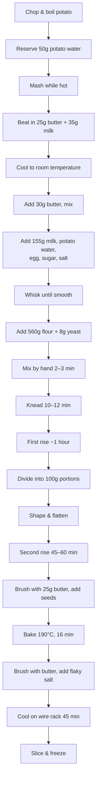

## Introduction
I have been refining my smash burger setup over the past few months. The meat and method are where I want them. The bun is the part I have not figured out yet.

Brioche has too much sugar for my preference. Standard burger buns are fine but nothing special. I have heard potato buns are soft, lightly sweet, and hold up well under a juicy burger, but it seems to be more of an American thing. Fresh ones are not available in the UK and the only options are frozen imports.

After some research, I realised I could make these myself. This post documents my journey from first attempt to final recipe. I expected it would take many attempts to dial in, but I got there in two. It was also the first time I had made dough or baked anything like this.

> **What this post covers**  
> The smash burger context, method evolution across batches, practical tips for beginners, and the final recipe.
{: .prompt-info }

---

## Context
The bun needs to match the burger. I want excellence. This section explains the build so the requirements make sense. You can read how I make the smash burger in detail [(coming soon)](https://notes.digitalden.cloud/){:target="_blank"}.

### Beef

| Component | Specification |
|-----------|---------------|
| Cuts | Dry-aged ribeye cap + chuck |
| Fat ratio | ~25% |
| Preparation | Butcher-minced fresh |

I get my beef from [Notting Hill Fish + Meat Shop](https://nottinghillfishshop.co.uk/){:target="_blank"}. I have tried a lot of butchers and different cuts over the past few months, and this one tastes the best. The flavour really comes through on the smash, and because I only season with salt and pepper, you can tell when the beef is good. I ask them to mince it fresh while I wait, and I tell them I want a higher fat ratio for taste. They grind it medium, so it is coarser than typical mince.

There is something satisfying about watching him pull at the ribeye steak and then feed it through the mincer. Otherwise I can never really trust where the mince comes from or what cuts they use. I assume most butchers use off-cuts and people would not know any better.

>
The dry-aged ribeye cap is the outer muscle of the ribeye, sometimes called the spinalis. It is the most marbled, most flavourful part of the steak. Dry-aging concentrates that flavour further. On its own it would be too rich and loose for a burger, so I add chuck. Chuck comes from the shoulder. It has good fat content but also more connective tissue, which gives the mince structure and helps it hold together when smashed.
{: .prompt-tip }

The blend gives me strong beef flavour from the ribeye cap, with enough body from the chuck to form a proper patty.

### Patties
Patties are portioned at 60g each. I experimented with 100g patties but they were difficult to smash from frozen. 60g is more sensible. This size smashes easily, maximises crust surface area, and cooks evenly. Protein is scaled by stacking patties rather than increasing thickness. A typical build uses two or three patties.

### Cooking

| Step | Method |
|------|--------|
| Surface | [ProCook Elite Tri-Ply Frying Pan 30cm](https://www.procook.co.uk/product/procook-elite-tri-ply-frying-pan-uncoated-30cm){:target="_blank"}, very hot |
| Fat | Refined avocado oil |
| Smash | Frozen ball placed on pan, smashed immediately on contact |
| Flip | Once only |
| Seasoning | Salt added after smashing, on exposed surface |

I love this pan. Uncoated stainless steel, handles high heat, and lasts forever. I look after it with Bar Keepers Friend!

### Why Make My Own Buns
I already [avoid supermarket bread](https://notes.digitalden.cloud/posts/sourdough-post/){:target="_blank"} because of preservatives and additives. The same applies to burger buns. I want to know what is in them and keep the ingredients minimal.

Making my own means I control the sugar, choose quality ingredients, and avoid preservatives entirely. I always try to use the best ingredients I can find. Kerrygold butter, good flour, real potato.

Potato buns are common in the US but not here. Frozen imports exist but do not match what I have read about. Making them myself was the obvious next step.

---

## Practical Tips for Beginners
I learned these through trial and error. If you are new to baking, these will save you time.

### Why Weigh Liquids in Grams
Weighing is more accurate than measuring by volume. Milk and water are close to 1:1 (1ml ≈ 1g), but not exact. Milk is slightly denser than water due to fat, protein, and sugars. The difference is small but adds up in larger quantities.

More importantly, weighing removes variability. Measuring jugs are imprecise. Your eye level, the meniscus, and the jug's markings all introduce error. A scale gives you the same result every time. In baking, hydration ratios matter. A few grams off on liquid can change dough texture noticeably.

### Butter Temperature
Butter straight from the fridge takes 30–60 minutes to reach room temperature, depending on your kitchen. In winter, expect the longer end unless you have heating on.

**Quick tests:**
- Should give slightly when pressed but not be greasy or soft
- Holds its shape but dents with a finger

**If you are short on time:**
- Cut it into smaller cubes for more surface area
- Place near (not on) a warm surface
- Grate it with a box grater and it comes to temperature in minutes

### Mixing Order
Combine wet ingredients first and whisk until smooth. This dissolves sugar and salt and distributes everything evenly before the flour goes in.

Once flour and yeast are added, switch to hands. Mix in the bowl until the dough comes together into a shaggy mass with no dry flour visible. Then turn out onto a clean surface and knead.

### The Windowpane Test
Stretch a small piece of dough thin enough to see light through it. If it tears before becoming translucent, continue kneading. This confirms gluten development.

### First Rise
Cover the dough and leave at room temperature for approximately one hour until roughly doubled. To check if it is ready, press a floured finger into the dough about 1cm deep. If the indent springs back slowly and partially, it is ready. If it springs back immediately, give it more time.

### Shaping
After the first rise, punch down the dough and divide into portions. Shape each into a smooth ball, then flatten slightly with your palm. You want disc shapes, not tall rounds. They will rise upward during proofing and baking, so pressing down now gives you the wider burger bun shape.

### Second Rise
Cover and leave for 45 minutes to 1 hour until puffy and nearly doubled. Poke test: a gentle press should spring back slowly. If it does not spring back at all, they are slightly overproofed. Bake immediately.

### The Fridge as a Pause Button
If your schedule does not line up with the dough's timing, refrigerate it. After shaping and placing on the tray, cover and refrigerate. The cold slows the yeast right down. Buns can hold for several hours or even overnight.

When ready to bake, remove from the fridge 30–45 minutes before to warm up and finish proofing. Then bake as normal.

### Glazing
Brush melted butter on the tops only. The sides do not need it. They will brown naturally in the oven and will not be visible once the burger is assembled. Add sesame seeds to the buttered tops. They will stick to the butter.

### Cooling
Cool uncovered on a wire rack. Do not leave them on the baking tray. The bottoms trap steam and go soggy. A wire rack lets air circulate underneath so they dry evenly. Texture improves significantly after approximately 45 minutes of cooling.

---

## Batch 1
This was my first time making dough from scratch. I was short on time at points during this batch, which affected some decisions. I wanted to see if the method works and identify what to adjust next time.

### Ingredients

| Ingredient | Brand / Source | Amount |
|------------|----------------|--------|
| Flour | [Waitrose White Canadian Bread Flour](https://www.waitrose.com/ecom/products/waitrose-white-canadian-bread-flour/006224-2744-2745?srsltid=AfmBOop0pBc7BFJi3_K4-X07Q4996B7opXwJ-7bk3DtusWRmw7RRDdpy){:target="_blank"} | 560g |
| Yeast | [Allinson Easy Bake Yeast](https://www.waitrose.com/ecom/products/allinsons-easy-bake-yeast/812479-260924-260925){:target="_blank"} | 8g |
| Butter | [Kerrygold Unsalted](https://www.waitrose.com/ecom/products/kerrygold-unsalted-butter/876457-215271-215272){:target="_blank"} | 56g (dough) + 45g (glaze) |
| Milk | [Duchy Organic Unhomogenised Whole Milk](https://www.waitrose.com/ecom/products/duchy-organic-unhomogenised-whole-milk-1-pint/015864-7587-7588){:target="_blank"} | 240g |
| Egg | [Organic free range, Notting Hill Farmers Market](https://rookeryfarm.com/){:target="_blank"} | 1 large |
| Potato | [Waitrose Maris Piper](https://www.waitrose.com/ecom/products/waitrose-maris-piper-potatoes/085063-372142-43169){:target="_blank"}, boiled and mashed | 120g |
| Sugar | White granulated | 45g |
| Salt | Fine | 12g |
| Topping | Sesame seeds + flaky salt | To taste |

I chose Canadian very strong flour for gluten development. Kerrygold for flavour. Instant yeast for simplicity. Real potato for structure and moisture retention.

### Nutrition per Bun
Based on the recipe yielding 12 buns:

| Nutrient | Per Bun (90g) |
|----------|---------------|
| Calories | ~220 kcal |
| Protein | ~6g |
| Carbohydrates | ~38g |
| Fat | ~5g |
| Sugar | ~4g |

This is lower in sugar than brioche, which typically has 6–8g per bun. The potato adds moisture without adding much sugar.

---

### Method
#### Step 1: Mashed Potato
Boiled one medium potato until soft. Mashed smooth. Weighed out 120g for the dough.

#### Step 2: Mixing
Combined mashed potato, milk, egg, and cold butter (straight from the fridge, did not have time to bring it to room temperature). Added sugar, salt, flour, and instant yeast.

#### Step 3: Kneading
Mixed by hand, then kneaded for 10–12 minutes until smooth and elastic. The dough passed the windowpane test.

#### Step 4: First Rise
Shaped dough into a ball. Placed in an oiled bowl, covered, and left at room temperature for approximately one hour.

The dough rose slightly. I then refrigerated it for approximately two hours due to a scheduling constraint. This slowed fermentation but did not stop it.

#### Step 5: Post-Fridge Rest
Removed dough from fridge. Left at room temperature for approximately 30 minutes before shaping.

#### Step 6: Shaping
Punched down the dough. Turned out onto a clean surface and divided into 12 portions at 90g each. Trimmed and redistributed where necessary to make weights consistent.

Shaped each portion into a smooth ball, flattened slightly, and placed on a parchment-lined tray with approximately 2.5cm spacing.

#### Step 7: Second Rise
Covered and left to rise for approximately 45 minutes until puffy and nearly doubled.

#### Step 8: Bake
Preheated oven to 190°C. Brushed each bun with melted butter and added sesame seeds. Baked for 16 minutes until golden.

#### Step 9: Finish
Brushed hot buns with remaining melted butter. Added flaky salt. Cooled uncovered on a wire rack.

Texture improved significantly after approximately 45 minutes of cooling.

#### Step 10: Freeze
Sliced each bun in half and placed into freezer bags. Stored in the freezer. I toast them straight from frozen when needed.

---

### Observations

| Attribute | Observation |
|-----------|-------------|
| Texture | Soft, slightly dense |
| Structure | Strong, held up under a triple-stack with cheese |
| Size | 90g felt small relative to the burger build |
| Crust | Golden, butter glaze worked well, sesame seeds adhered |
| Cooling | Texture settled and improved after full cooling |

The buns performed well structurally. No collapse or sogginess under a 180g beef stack with melted American cheese. The density was acceptable but could be lighter. The main issue was size. 90g buns felt undersized for the intended build.

For a first attempt at baking, I was pleased with the result.

---

### Notes for Next Batch

| Area | Adjustment |
|------|------------|
| Size | Increase to 100–110g per bun |
| Potato | Increase significantly for softer crumb |
| Enriched mash | Mash while hot, beat in butter and warm milk, cool before adding to dough |
| Potato water | Reserve and use in dough for added starch and tenderness |
| Butter | Reduce standalone butter, bring remainder to room temperature |
| Milk | Reduce standalone milk to compensate for increased potato moisture |
| Proofing | Allow longer second rise if time permits |
| Flour | Keep current (performed well) |
| Yeast | Keep current (performed well) |
| Structure | Maintain, do not sacrifice for softness |

The method works. The next batch focuses on scaling bun size and improving softness while preserving structure.

Enriching the mash should help with tenderness. Warm potato absorbs fat and liquid better than cold dough does. When you mash butter and milk into hot potato, the starches swell and trap the fat. That fat stays suspended in the potato rather than coating the flour proteins. This means gluten can still develop properly while the potato adds tenderness throughout. Total fat and liquid stays the same, the difference is where it sits in the dough.

Potato water contains dissolved starch which contributes to softness and a slightly glossy crumb. Rather than adding it on top of existing liquid, it replaces some of the milk to keep total hydration balanced.

---

## Batch 2
This batch addressed all the issues from Batch 1: size, softness, and method refinement. The result was significantly better. This is now my go-to recipe.

### Key Changes from Batch 1

| Change | Rationale |
|--------|-----------|
| Potato increased from 120g to 250g | Softer, more tender crumb |
| Enriched mash method | Butter and milk beaten into hot potato before cooling |
| Potato water added | Dissolved starch for additional tenderness |
| Milk reduced | Compensates for increased moisture from potato |
| Bun size increased to 100g | Better proportion for the burger build |
| Butter glaze reduced to 25g | 45g was excessive; 25g provided even coverage |

### Ingredients

#### Enriched Mash

| Ingredient | Amount |
|------------|--------|
| Potato (boiled and mashed while hot) | 250g |
| Butter (beaten into hot mash) | 25g |
| Warm milk (beaten into hot mash) | 35g |

Mash the potato while still hot. Beat in the butter and warm milk until smooth. Cool to room temperature before adding to the dough.

> **Why enrich the mash**  
> When you beat butter and milk into hot potato, the swollen starch granules absorb and trap the fat. This keeps the fat suspended in the potato rather than coating the flour proteins directly. The result is gluten can still develop properly for structure, but the potato distributes tenderness throughout the crumb.
{: .prompt-tip }

#### Main Dough

| Ingredient | Brand / Source | Amount |
|------------|----------------|--------|
| Flour | [Waitrose White Canadian Bread Flour](https://www.waitrose.com/ecom/products/waitrose-white-canadian-bread-flour/006224-2744-2745?srsltid=AfmBOop0pBc7BFJi3_K4-X07Q4996B7opXwJ-7bk3DtusWRmw7RRDdpy){:target="_blank"} | 560g |
| Yeast | [Allinson Easy Bake Yeast](https://www.waitrose.com/ecom/products/allinsons-easy-bake-yeast/812479-260924-260925){:target="_blank"} | 8g |
| Butter | [Kerrygold Unsalted](https://www.waitrose.com/ecom/products/kerrygold-unsalted-butter/876457-215271-215272){:target="_blank"}, room temperature | 30g |
| Milk | [Duchy Organic Unhomogenised Whole Milk](https://www.waitrose.com/ecom/products/duchy-organic-unhomogenised-whole-milk-1-pint/015864-7587-7588){:target="_blank"} | 155g |
| Potato water | Reserved from boiling | 50g |
| Egg | [Organic free range, Notting Hill Farmers Market](https://rookeryfarm.com/){:target="_blank"} | 1 large |
| Sugar | White granulated | 45g |
| Salt | Fine (or finely ground pink Himalayan) | 12g |

#### Glaze and Topping

| Ingredient | Amount |
|------------|--------|
| Butter (melted) | 25g |
| Sesame seeds | To taste |
| Flaky salt | To taste |

> **Potato preparation note**  
> Potatoes lose weight during boiling. To get 250g mash, start with approximately 280–300g raw potato. Reserve the potato water before draining.
{: .prompt-info }

### Nutrition per Bun
Based on the recipe yielding 10–11 buns:

| Nutrient | Per Bun (100g) |
|----------|----------------|
| Calories | ~245 kcal |
| Protein | ~6g |
| Carbohydrates | ~42g |
| Fat | ~6g |
| Sugar | ~4.5g |

---

### Method

#### Step 1: Boil and Mash Potato
Chopped potato into smaller pieces to speed up boiling. Boiled until soft. Reserved 50g of the potato water before draining. Mashed the potato while hot until smooth.

#### Step 2: Enrich the Mash
Beat 25g butter and 35g warm milk into the hot mash until fully incorporated. Set aside to cool to room temperature.

#### Step 3: Combine Wet Ingredients
In a large bowl, combined the cooled enriched mash with:
- 30g room temperature butter
- 155g milk
- 50g potato water
- 1 egg
- 45g sugar
- 12g salt

Whisked until smooth (about 30 seconds to a minute).

#### Step 4: Add Dry Ingredients
Added 560g flour and 8g instant yeast. Mixed by hand in the bowl for 2–3 minutes until the dough came together into a shaggy mass with no dry flour visible.

#### Step 5: Knead
Turned out onto a clean surface and kneaded for 10–12 minutes until smooth and elastic. The dough passed the windowpane test.

#### Step 6: First Rise
Shaped into a ball, placed in an oiled bowl, covered with a towel, and left at room temperature for approximately one hour until roughly doubled.

Poke test confirmed readiness: indent sprang back slowly and partially.

#### Step 7: Shape
Punched down the dough. Divided into 10 portions at 100g each. Shaped each into a smooth ball, flattened slightly with palm, and placed on a parchment-lined tray.

#### Step 8: Second Rise
Covered and refrigerated for 1 hour (scheduling constraint). Removed from fridge and left at room temperature for 30–45 minutes until puffy.

Alternatively, if time permits, skip refrigeration and proof at room temperature for 45 minutes to 1 hour.

#### Step 9: Bake
Preheated oven to 190°C. Brushed tops with 25g melted butter. Added sesame seeds. Baked for 16 minutes until golden.

#### Step 10: Finish
Brushed hot buns with any remaining melted butter. Added flaky salt. Transferred immediately to a wire rack to cool uncovered.

#### Step 11: Rest
Left to cool uncovered on the wire rack for approximately 45 minutes. The texture settles and improves significantly during this time. Do not skip this step.

#### Step 12: Freeze
Once fully cooled, sliced each bun in half and stored in freezer bags. Toast straight from frozen when needed.

#### Step 13: Share
For transporting to friends, place cooled buns in brown paper bags. They breathe better than plastic and keep the crust from going soft.

---

### Observations

| Attribute | Observation |
|-----------|-------------|
| Texture | Noticeably softer than Batch 1, lighter crumb |
| Structure | Still strong, held up under triple-stack with cheese |
| Size | 100g felt right for the burger build |
| Crust | Golden, even colour, sesame seeds adhered well |
| Flavour | Subtle potato sweetness, clean taste |
| Glaze | 25g was perfect coverage for 10 buns |

The enriched mash method made a clear difference. The crumb was softer and more tender while maintaining enough structure to hold a loaded burger. The potato water contributed to a slightly glossy interior.

External validation: "10/10, the best ones she's had."

---

## Final Recipe

| Component | Final Specification |
|-----------|---------------------|
| Flour | Waitrose White Canadian Bread Flour, 560g |
| Yeast | Allinson Easy Bake Yeast (instant), 8g |
| Butter | Kerrygold unsalted: 25g in mash, 30g in dough, 25g glaze |
| Potato | 250g mashed, enriched with butter and milk |
| Potato water | 50g reserved from boiling |
| Milk | 35g in mash, 155g in dough |
| Bun weight | 100g (yields 10–11 buns per batch) |
| Bake | 190°C, 16 minutes |
| Outcome | Soft, structured, holds up under loaded smash burgers |

---

## Summary

This is now my go-to potato bun recipe. The combination of quality ingredients, enriched mash method, and proper technique produces buns that match the burger I have built around them.

From butcher-selected cuts to handmade buns, every component is intentional. That is the standard.

---

*Documented January 2026.*